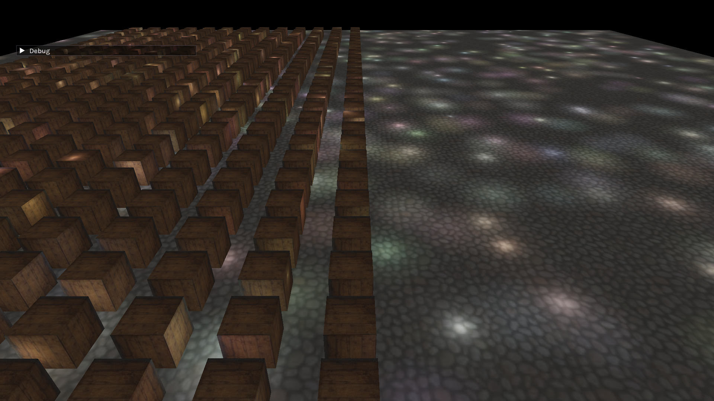

# Clustered Shading

Clustered shading is a technique that allows for efficient rendering of
thousands of dynamic lights in 3D perspective games. It can be integrated into both forward and deferred rendering pipelines with 
minimal intrusion.

# Showcase


*(top) 512 lights (bottom) 1024 lights | both scenes rendered using clustered deferred on an Intel CometLake-H GT2 iGPU @60 fps*

# Overview

The "traditional" method for dynamic lighting is to loop over every light in the scene to
shade a single fragment. But this is a huge limitation as there can be millions of fragments to shade on a modern display.

What if we could just loop over the lights we know will affect a given fragment? Enter clustered shading.

> [!IMPORTANT]
> Clustered shading divides the view frustum into 3D blocks (clusters)
> and assigns lights to each based on the light's influence. If a light is too far away, it is not
> visible to the cluster. Then in the shading step, a fragment retrieves the light list for the cluster it's in.
> This increases efficiency by only considering lights that are very likely to affect the fragment.

Clustered shading can be thought of as the "natural evolution" to traditional dynamic lighting. It's not a super well known
technique. Since its introduction in 2012, Clustered shading has mostly stayed in the realm of research papers and behind the doors of big game studios. 
My goal is to present a simple implementation with clear reasoning behind every decision. Something that might fit
in a [LearnOpenGL](https://learnopengl.com/) article.

We'll be using OpenGL 4.3 and C++. I'll assume you have working knowledge of both.

> [!TIP]
> If you are viewing this in dark mode on Github, I recommend trying out light mode high contrast for easier reading.
> In dark mode, text can appear blurry. 


## Step 1: Splitting the view frustum into clusters

<p align="center">
  
</p>

*The view frustum and camera position (center of projection) form a pyramid like shape*

The definition of the view frustum is the space between the `zNear` and `ZFar` planes. This is the part the camera can "see". Shading is only done
on fragments that are in the frustum.

Our goal is to divide this volume into a 3D grid of clusters. We'll define the clusters in view space so
they are always relative to where the camera is. This allows for a small optimization: we can build the cluster grid sporadically instead of every frame.
It only needs to be rebuilt when the projection matrix changes. Such as when near/far planes, fov, or screen dimensions change.

But the optimization is optional. This step of clustered shading is usually very fast.

### Dvision Scheme

<p align="middle">
  
  
</p>

*uniform division (left) and exponential division (right)*

There are two main ways to distribute the frustum along the depth. Uniform and exponential division.

The exponential division lets us
cover the same area with fewer divisions. And we generally don't care if this causes a lot of lights to
be assigned to those far out clusters. Less of an object appears on the screen the further out in perspective projection,
and thus fewer fragments to shade.

So exponential division it is. We'll use the equation below which closely matches the image on the left.

```math
\LARGE
Z=\text{Near}_z\left(\frac{\text{Far}_z}{\text{Near}_z}\right)\Huge^{\frac{\text{slice}}{numslices}}
```

- $Z$ is the positive distance from the camera position
- $\text{Near}_z$ and $\text{Far}_z$ represent the near and far planes
- $\text{slice}$ is the current slice index
- $\text{numslices}$ is the total number of slices to divide with.

This equation gives us the positive distance from the camera a slice should be.

### Cluster Dimensions

In adition to slicing the frustum along the depth, we also need to divide each slice on the xy axis.
What subdivision scheme to use is up to you. If your near and far planes are very far apart, you'll want more depth slices.

A good place to start is 16x9x24 (x, y, z-depth) which is what [DOOM 2016](https://advances.realtimerendering.com/s2016/Siggraph2016_idTech6.pdf) uses.
I personally use 12x12x24 to show the division scheme can be anything you choose. 

### Cluster shape

The simplest way to represent the shape of the clusters is an AABB (Axis Aligned Bounding Box).
Unfortunately, a side effect is that the AABBs must overlap to cover the frustum shape.
This image shows that.

<p align="center">

</p>

*The points used to create the AABB cause overlapping boundaries*

This still gives good results performance wise. You could choose a more accurate shape
and improve shading time as lights are better assigned to their clusters.
But what you're ultimately doing is trading faster shading for slower culling.

In fact, I'll make a bold claim: This algorithm does not benefit from more accurate cluster shapes or distributions of clusters.
The reason being, there is not a lot of room for optimization without complicating and slowing down the cluster creation or culling step.

### Implementation

We use a compute shader to build the cluster grid. This is all fully functioning code, taken straight from my OpenGL playground project.

<details open>
  <summary>GLSL</summary>

```glsl
#version 430 core
layout(local_size_x = 1, local_size_y = 1, local_size_z = 1) in;

struct Cluster
{
    vec4 minPoint;
    vec4 maxPoint;
    uint count;
    uint lightIndices[100];
};

layout(std430, binding = 1) restrict buffer clusterSSBO {
    Cluster clusters[];
};

uniform float zNear;
uniform float zFar;

uniform mat4 inverseProjection;
uniform uvec3 gridSize;
uniform uvec2 screenDimensions; // framebuffer pixel dimensions to be exact

vec3 screenToView(vec2 screenCoord);
vec3 lineIntersectionWithZPlane(vec3 startPoint, vec3 endPoint, float zDistance);

void main()
{
    // Eye position is zero in view space
    const vec3 eyePos = vec3(0.0);

    uint tileIndex = gl_WorkGroupID.x + gl_WorkGroupID.y * gridSize.x +
            gl_WorkGroupID.z * gridSize.x * gridSize.y;
    vec2 tileSize = screenDimensions / gridSize.xy;

    // calculate the min and max points of a tile in screen space
    vec2 minPoint_screenSpace = gl_WorkGroupID.xy * tileSize;
    vec2 maxPoint_screenSpace = (gl_WorkGroupID.xy + 1) * tileSize;

    // convert them to view space sitting on the near plane
    vec3 minPoint_viewSpace = screenToView(minPoint_screenSpace);
    vec3 maxPoint_viewSpace = screenToView(maxPoint_screenSpace);

    float tileNear =
        zNear * pow(zFar / zNear, gl_WorkGroupID.z / float(gridSize.z));
    float tileFar =
        zNear * pow(zFar / zNear, (gl_WorkGroupID.z + 1) / float(gridSize.z));

    // Find the 4 intersection points from the min/max points to this cluster's
    // near and far planes
    vec3 minPointNear =
        lineIntersectionWithZPlane(eyePos, minPoint_viewSpace, tileNear);
    vec3 minPointFar =
        lineIntersectionWithZPlane(eyePos, minPoint_viewSpace, tileFar);
    vec3 maxPointNear =
        lineIntersectionWithZPlane(eyePos, maxPoint_viewSpace, tileNear);
    vec3 maxPointFar =
        lineIntersectionWithZPlane(eyePos, maxPoint_viewSpace, tileFar);

    vec3 minPointAABB = min(minPointNear, minPointFar);
    vec3 maxPointAABB = max(maxPointNear, maxPointFar);

    clusters[tileIndex].minPoint = vec4(minPointAABB, 0.0);
    clusters[tileIndex].maxPoint = vec4(maxPointAABB, 0.0);
}

// Returns the intersection point of an infinite line and a
// plane perpendicular to the Z-axis
vec3 lineIntersectionWithZPlane(vec3 startPoint, vec3 endPoint, float zDistance)
{
    vec3 direction = endPoint - startPoint;
    vec3 normal = vec3(0.0, 0.0, -1.0); // plane normal

    // skip check if the line is parallel to the plane.

    float t = (zDistance - dot(normal, startPoint)) / dot(normal, direction);
    return startPoint + t * direction; // the parametric form of the line equation
}
vec3 screenToView(vec2 screenCoord)
{
    // normalize screenCoord to [-1, 1] and
    // set the depth of the coordinate to be on the near plane. This is -1 by
    // default in OpenGL.
    vec4 ndc = vec4(screenCoord / screenDimensions * 2.0 - 1.0, -1.0, 1.0);

    vec4 viewCoord = inverseProjection * ndc;
    viewCoord = viewCoord / viewCoord.w;
    return viewCoord.xyz;
}
```

</details>

<details>
  <summary>C++</summary>

```cpp
namespace Compute
{
constexpr unsigned int gridSizeX = 12;
constexpr unsigned int gridSizeY = 12;
constexpr unsigned int gridSizeZ = 24;

struct alignas(16) Cluster
{
  glm::vec4 minPoint;
  glm::vec4 maxPoint;
  unsigned int count;
  unsigned int lightIndices[100];
};

unsigned int clusterGridSSBO;

void init_ssbos()
{
  // clusterGridSSBO
  {
    glGenBuffers(1, &clusterGridSSBO);
    glBindBuffer(GL_SHADER_STORAGE_BUFFER, clusterGridSSBO);

    // NOTE: we only need to allocate memory. No need for initialization because
    // comp shader builds the AABBs.
    glBufferData(GL_SHADER_STORAGE_BUFFER, sizeof(Cluster) * numClusters,
                 nullptr, GL_STATIC_COPY);
    glBindBufferBase(GL_SHADER_STORAGE_BUFFER, 4, clusterGridSSBO);
  }
}

Shader clusterComp;

void cull_lights_compute(const Camera &camera)
{
  auto [width, height] = Core::get_framebuffer_size();

  // build AABBs every frame
  clusterComp.use();
  clusterComp.set_float("zNear", camera.near);
  clusterComp.set_float("zFar", camera.far);
  clusterComp.set_mat4("inverseProjection", glm::inverse(camera.projection));
  clusterComp.set_uvec3("gridSize", {gridSizeX, gridSizeY, gridSizeZ});
  clusterComp.set_uvec2("screenDimensions", {width, height});

  glDispatchCompute(gridSizeX, gridSizeY, gridSizeZ);
  glMemoryBarrier(GL_SHADER_STORAGE_BARRIER_BIT);
}

void init()
{
  init_ssbos();
  // load shaders
  clusterComp = Shader("clusterShader.comp");
}

```

</details>

I encourage you to stop here and adapt this code into your game or engine and study it! See if you can spot the exponential formula from earlier.

We divide the screen into tiles and convert the points to view space sitting on the camera near plane. This
essentially leaves us with a divided near plane. Then for each min and max point of a tile on the near plane, 
we draw a line from the origin through that point and intersect it with the **_cluster's_** near and far planes. 
The intersection points together form the bound of the AABB.

> [!NOTE] 
> Converting the screen coords to view space on the near plane **relies** on the fact that by default in OpenGL, a depth of -1 in NDC corresponds to the near plane. 
> If you are using a reverse Z buffer, the near plane would be 1. 

And a few notes the C++ side:
1. `glMemoryBarrier(GL_SHADER_STORAGE_BARRIER_BIT);` ensures the writes to the SSBO (Shader Storage Buffer Object) by the compute shader are visible to the next shader.

2. `alignas(16)` is used to correctly match the C++ struct memory layout with how the SSBO expects it.

   According to the [OpenGL Spec](https://registry.khronos.org/OpenGL/specs/gl/glspec46.core.pdf#page=169&zoom=146,46,581), the `std430` memory layout requires
   the base alignment of an array of structures to be the base alignment of the largest member in the structure.

   ```cpp
   struct alignas(16) Cluster
   {
     glm::vec4 minPoint; // 16 bytes
     glm::vec4 maxPoint; // 16 bytes
     unsigned int count; // 4 bytes
     unsigned int lightIndices[100]; // 400 bytes
   };
   ```

   The largest element in this struct is a vec4 of 16 bytes. Since we are storing an array of Cluster, the struct should have its memory aligned
   to 16 bytes. If you don't know what memory alignment is, don't worry.
   We basically need to add padding bytes to make the total struct size a multiple of 16 bytes.
   We can manually add some dummy variables or let the compiler handle it with `alignas`.

   > If you are not storing an array of structures in `std430`, and as long as you [stay away from vec3](https://stackoverflow.com/q/38172696/19633924), you _probably_ don't need to worry about alignment.

## Step 2: Assigning Lights to Clusters (Culling)
Our goal now is to cull the lights. The most common type of light used in games is the point light. A point light 
has a position and radius which define a sphere of influence. 

We test the light sphere against a cluster AABB. 
If the light intersects, it is visible to the cluster, and we append it to the cluster light list.

Let's dive into the Cluster struct.

```glsl
  struct Cluster
  {
    vec4 minPoint; // min point of AABB in view space
    vec4 maxPoint; // max point of AABB in view space
    uint count;
    uint lightIndices[100]; // elements point directly to global light list
  };
```

- The min and max define the AABB of this cluster like from before.

- `lightIndices` contains the lights visible to this cluster. We hardcode a max of 100 lights visible to a cluster at any time. You'll see this number used a few times elsewhere.
  If you want to increase the number, make sure to change it everywhere.

- `count` keeps tracks of how many lights are visible. It tells how much to read from the `lightIndices` array.

We'll use another compute shader to cull the lights. Compute shaders are just so awesome because they are general purpose. 
They are great for parallel tasks. In our case, testing intersection of thousands of lights against thousands of clusters. 

Let's have each invocation process a single cluster.

<details>
  <summary>What is an invocation?</summary>
    
- Compute shaders have the abstract idea of a workgroup. Each workgroup has its own invocations (called workgroup size or local_size). 
You can loosely think of invocations as threads. Each *thread* is an independent execution of the main function.

</details>

For each cluster, we loop over all the lights in the scene and test intersection with the cluster AABB.
If there is intersection, the light must be visible to the cluster. It is added to the lightIndices array.

And here is the full compute shader

<details open>
<summary>GLSL</summary>

```glsl
#version 430 core

#define LOCAL_SIZE 128
layout(local_size_x = LOCAL_SIZE, local_size_y = 1, local_size_z = 1) in;

struct PointLight
{
    vec4 position;
    vec4 color;
    float intensity;
    float radius;
};

struct Cluster
{
    vec4 minPoint;
    vec4 maxPoint;
    uint count;
    uint lightIndices[100];
};

layout(std430, binding = 1) restrict buffer clusterSSBO
{
    Cluster clusters[];
};

layout(std430, binding = 2) restrict buffer lightSSBO
{
    PointLight pointLight[];
};

bool testSphereAABB(uint i, Cluster c);

uniform mat4 viewMatrix;

//note: tiles actually mean clusters
void main()
{
    uint lightCount = pointLight.length();
    uint tileIndex = gl_WorkGroupID.x * LOCAL_SIZE + gl_LocalInvocationID.x;
    Cluster cluster = clusters[tileIndex];

    // we need to reset count because culling runs every frame.
    // otherwise it would accumulate.
    cluster.count = 0;

    for (uint i = 0; i < lightCount; ++i)
    {
        if (testSphereAABB(i, cluster) && cluster.count < 100)
        {
            cluster.lightIndices[cluster.count] = i;
            cluster.count++;
        }
    }
    clusters[tileIndex] = cluster;
}

bool sphereAABBIntersection(vec3 center, float radius, vec3 aabbMin, vec3 aabbMax)
{
    // closest point on the AABB to the sphere center
    vec3 closestPoint = clamp(center, aabbMin, aabbMax);
    // squared distance between the sphere center and closest point
    float distanceSquared = dot(closestPoint - center, closestPoint - center);
    return distanceSquared <= radius * radius;
}

// this just unpacks data for sphereAABBIntersection
bool testSphereAABB(uint i, Cluster cluster)
{
    vec3 center = vec3(viewMatrix * pointLight[i].position);
    float radius = pointLight[i].radius;

    vec3 aabbMin = cluster.minPoint.xyz;
    vec3 aabbMax = cluster.maxPoint.xyz;

    return sphereAABBIntersection(center, radius, aabbMin, aabbMax);
}
```

</details>

Now let's update the C++ code. Mainly to create the lights. How exactly this is done is different for everyone.
But the following suits the basic purpose.  

<details>
<summary>C++</summary>

The important part is to create and fill the light SSBO. Note the use of `alignas` in the PointLight struct definition. 

```cpp
struct alignas(16) PointLight
{
  glm::vec4 position;
  glm::vec4 color;
  float intensity;
  float radius;
};

int main()
{

  std::mt19937 rng{std::random_device{}()};

  constexpr int numLights = 512;
  std::uniform_real_distribution<float> distXZ(-100.0f, 100.0f);
  std::uniform_real_distribution<float> distY(0.0f, 55.0f);

  std::vector<PointLight> lightList;
  lightList.reserve(numLights);
  for (int i = 0; i < numLights; i++)
  {
    PointLight light{};
    float x = distXZ(rng);
    float y = distY(rng);
    float z = distXZ(rng);

    glm::vec4 position(x, y, z, 1.0f);

    light.position = position;
    light.color = {1.0, 1.0, 1.0, 1.0};
    light.intensity = 1;
    light.radius = 5.0f;

    lightList.push_back(light);
  }

  glGenBuffers(1, &lightSSBO);
  glBindBuffer(GL_SHADER_STORAGE_BUFFER, lightSSBO);

  glBufferData(GL_SHADER_STORAGE_BUFFER, lightList.size() * sizeof(PointLight),
               lightList.data(), GL_DYNAMIC_DRAW);

  glBindBufferBase(GL_SHADER_STORAGE_BUFFER, 2, lightSSBO);
}

```
```cpp
namespace Compute
{
constexpr unsigned int gridSizeX = 12;
constexpr unsigned int gridSizeY = 12;
constexpr unsigned int gridSizeZ = 24;

struct alignas(16) Cluster
{
  glm::vec4 minPoint;
  glm::vec4 maxPoint;
  unsigned int count;
  unsigned int lightIndices[100];
};

unsigned int clusterGridSSBO;

void init_ssbos()
{
  // clusterGridSSBO
  {
    glGenBuffers(1, &clusterGridSSBO);
    glBindBuffer(GL_SHADER_STORAGE_BUFFER, clusterGridSSBO);

    // NOTE: we only need to allocate memory. No need for initialization because
    // comp shader builds the AABBs.
    glBufferData(GL_SHADER_STORAGE_BUFFER, sizeof(Cluster) * numClusters,
                 nullptr, GL_STATIC_COPY);
    glBindBufferBase(GL_SHADER_STORAGE_BUFFER, 4, clusterGridSSBO);
  }
}

Shader clusterComp;
Shader cullLightComp;

void cull_lights_compute(const Camera &camera)
{
  auto [width, height] = Core::get_framebuffer_size();

  // build AABBs, doesn't need to run every frame but fast
  clusterComp.use();
  clusterComp.set_float("zNear", camera.near);
  clusterComp.set_float("zFar", camera.far);
  clusterComp.set_mat4("inverseProjection", glm::inverse(camera.projection));
  clusterComp.set_uvec3("gridSize", {gridSizeX, gridSizeY, gridSizeZ});
  clusterComp.set_uvec2("screenDimensions", {width, height});

  glDispatchCompute(gridSizeX, gridSizeY, gridSizeZ);
  glMemoryBarrier(GL_SHADER_STORAGE_BARRIER_BIT);

  // cull lights
  cullLightComp.use();
  cullLightComp.set_mat4("viewMatrix", camera.view);

  glDispatchCompute(27, 1, 1);
  glMemoryBarrier(GL_SHADER_STORAGE_BARRIER_BIT);
}

void init()
{
  init_ssbos();
  // load shaders
  clusterComp = Shader("clusterShader.comp");
  cullLightComp = Shader("clusterCullLightShader.comp");
}
```

</details>

The compute shader has 128 "threads" per workgroup. We dispatch 27 workgroups for a total of 3456 threads. 
This is to fit the design of each thread processing a single cluster. Remember we have 12x12x24 = 3456 clusters. 

If you change anything, make sure to change your dispatch to match the total thread count
with the number of clusters. 

Also, since each thread processes its own cluster and writes to its own part of the SSBO memory, we  don't need to use any shared memory or atomic operations!
This keeps the compute shader as parallel as possible.

## Step 3: Consumption in fragment shader

Now that we have built our cluster grid and assigned lights to clusters, we can finally consume this data.

We calculate the cluster a fragment is in, retrieve the light list for that cluster, and do cool lighting.
This is basically reversing the calculations in the cluster compute shader to solve for the xyz indexes of a cluster.

Your lighting shader should look something like this

```glsl
#version 430 core

// PointLight and Cluster struct definitions
//...
// bind to light and cluster ssbo
// same as cull compute shader

uniform float zNear;
uniform float zFar;
uniform uvec3 gridSize;
uniform uvec2 screenDimensions;

out vec4 FragColor;

void main()
{
    //view space position of a fragment
    vec3 FragPos = texture(gPosition, TexCoords).rgb;

    // Locating which cluster this fragment is part of
    uint zTile = uint((log(abs(FragPos.z) / zNear) * gridSize.z) / log(zFar / zNear));
    vec2 tileSize = screenDimensions / gridSize.xy;
    uvec3 tile = uvec3(gl_FragCoord.xy / tileSize, zTile);
    uint tileIndex =
        tile.x + (tile.y * gridSize.x) + (tile.z * gridSize.x * gridSize.y);

    uint lightCount = clusters[tileIndex].count;

    for (int i = 0; i < lightCount; ++i)
    {
        uint lightIndex = clusters[tileIndex].lightIndices[i];
        PointLight light = pointLight[lightIndex];
        // do cool lighting
    }
}
```

Here FragPos is the view space position of the fragment.
The absolute value of `FragPos.z` gives us the distance of the fragment from the camera.
Remember, that's exactly the left hand side of the exponential equation from earlier.

Solving that earlier equation for the slice results in the z index of the cluster.

```glsl
uint zTile = uint((log(abs(FragPos.z) / zNear) * gridSize.z) / log(zFar / zNear));
```

Finding the xy index of the cluster is very simple. We have the screen coordinates of the fragment from`gl_FragCoord.xy`, we just need to divide by
the tileSize. Again, this is the reverse of what the cluster compute shader does.

## Troubleshooting

If you are seeing flickering lights it could be either
1. Your light is affecting fragments outside its defined radius. This causes uneven lighting. Try adding a range check to your attenuation.

2. There are too many lights visible to a single cluster. Remember we hardcoded a max of 100 lights per cluster at any time. If this limit is hit, further lights
   will be ignored and they will be unpredictable. This can happen at further out clusters, since the exponential division causes those clusters to be very large. 

   **Solution:** Increase the light limit. The only cost is more GPU memory. You can also add a check in your lighting shader
   to output a warning color. 
   ```glsl
    uint lightCount = clusters[tileIndex].count;
    if (lightCount > 95) {
        //getting close to limit. Output red color and dip
        FragColor = vec4(1.0f, 0.0f, 0.0f, 1.0f);
        return;
    }
   ```


## Benchmarks

The following benchmarks were measured using `glFinish()` and regular C++ clocks on 
my linux machine using an Intel CometLake-H GT2. I found the integrated gpu results were more in line with what I expected.
It also shows the competitiveness of the algorithm on low-end hardware. 

The scene uses cluster shading with deferred rendering **without** any optimizations like frustum culling. 
- 12x12x24 cluster grid
- Camera near and far planes (0.1, 400)
- Light XZ positions allowed to range (-100, 100) and vertical Y (0, 55)
- 1920x1080 resolution
- Sponza model


| -                   | Building Clusters | Light Assignment | Shading | 
|---------------------|-------------------|------------------|---------|
| 512 lights (13.0f)  | 0.28 ms           | 0.95 ms          | 5.23 ms |
| 1,024 lights (7.0f) | 0.27 ms           | 1.50 ms          | 3.71 ms | 
| 2,048 lights (3.0f) | 0.42 ms           | 2.61 ms          | 2.84 ms | 
| 4,096 lights (2.0f) | 0.29 ms           | 5.15 ms          | 3.28 ms | 

### Optimization
The benchmarks show constructing the cluster grid takes constant time, while shading perf. is largely affected by light radius.
However, a bottleneck starts to appear in assigning lights to clusters. This makes sense since we are brute force testing every light against every cluster. We need some way to reduce the number of lights being tested. 

One way is to build a BVH (Bounding Volume Hierarchy) over the lights and traverse it in the culling step. This
can produce good results, but IMO it overcomplicates things. Clustered shading is already an optimization technique, and I have doubts about spiraling into a rabbit hole of optimizing the optimizers.

The easiest solution here is to frustum cull the lights and update the light SSBO every frame. Thus, we only test lights that are
in the view frustum. Frustum culling is fast and already standard in many games. 

## Further Reading
- [Clustered Deferred and Forward Shading - 2012](https://www.cse.chalmers.se/~uffe/clustered_shading_preprint.pdf): A research paper where
  clustered shading was first introduced.
- [A Primer On Efficient Rendering Algorithms & Clustered Shading - 2018](http://www.aortiz.me/2018/12/21/CG.html) An excellent blog post on the subject. from which much of this tutorial is based on.
- [Practical Clustered Shading - 2015](http://www.humus.name/Articles/PracticalClusteredShading.pdf) Presentation by Avalanche Studios
- [Simple Alternative to Clustered Shading for Thousands of Lights - 2015](https://worldoffries.wordpress.com/2015/02/19/simple-alternative-to-clustered-shading-for-thousands-of-lights/) 
   Alternative to clustered shading by building a BVH and traversing it directly in the shading step. 

-----------
*Questions, typos, or corrections? Feel free to open an issue or pull request!*